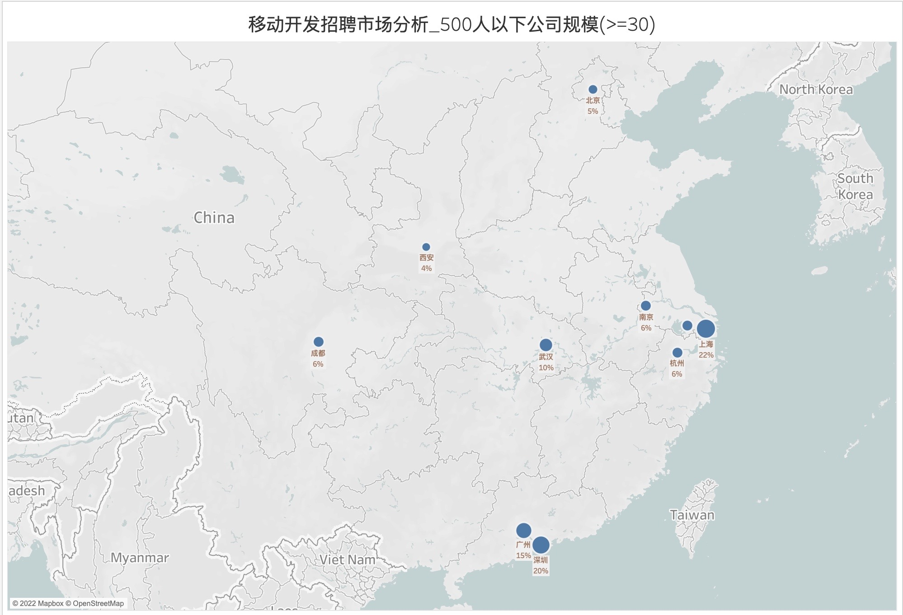
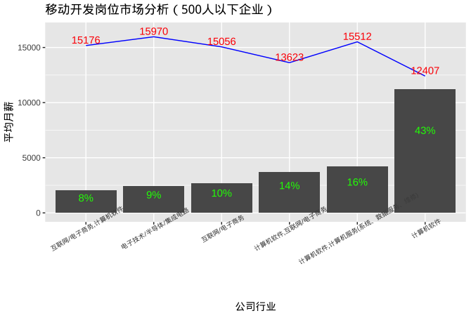
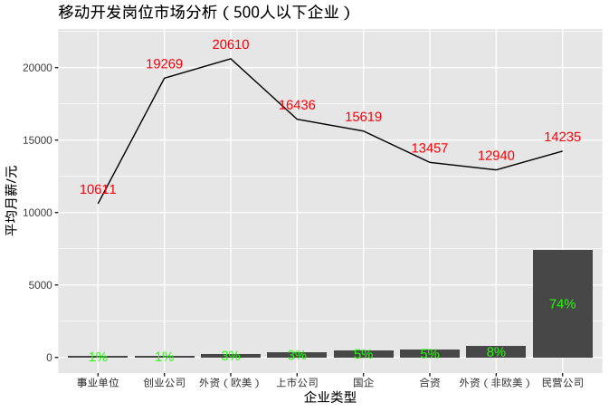
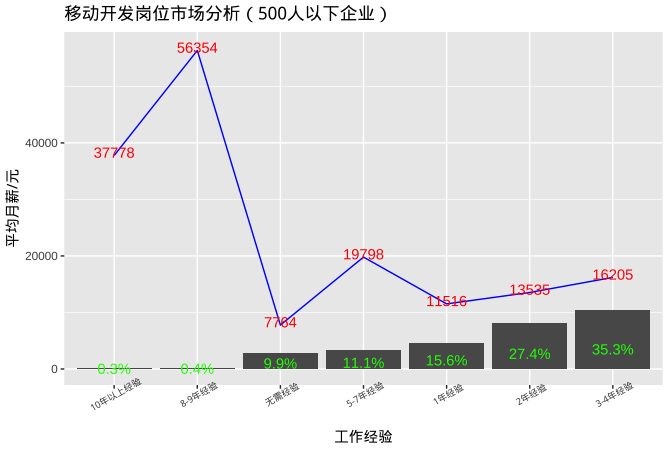
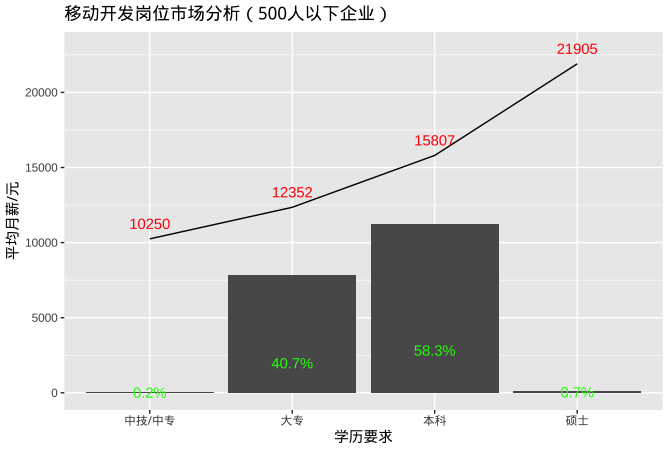
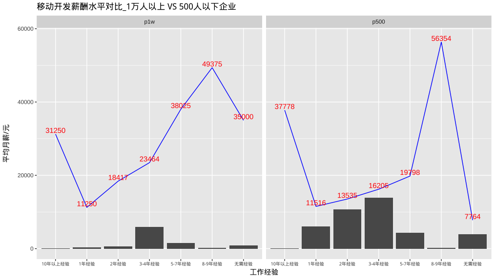

# 移动开发岗位招聘市场分析(500人以下企业规模)

## 总述

本次采集有效数据1786条，主要分析目标为500人以下企业规模的招聘需求和薪酬水平，形成数据998条。我们将从如下方面分析：

-   城市分布：招聘需求主要分布在广深上和武汉。

-   公司行业：招聘主要以计算机软件行业为主，占73%，平均月薪13847元。

-   公司类型：71%的招聘来自民企，平均月薪14235元。

-   工作经验：63%的公司招聘要求平均工作经验3年，平均月薪14870元 。

-   学历要求：41%的招聘要求大专，平均月薪12352元，58%要求本科，平均月薪15807元。

-   工作简述：主要围绕的工作：熟练掌握和使用编程语言(Android/iOS/C/C++/web前端UI/java/javascript/dart/React等)，尤其是安卓系统，架构设计，软件开发，项目经验，调试和测试软件或应用程序，需求分析，多线程处理，沟通、团队合作、解决问题、形成技术文档等，偏好计算机专业人才。

-   薪酬对比：企业规模500人以下 VS 1万人以上企业规模(这个蛮有趣哦)

## 城市分布

## 公司行业

## 公司类型

## 工作经验

## 学历要求

## 工作简述

## 薪酬对比

